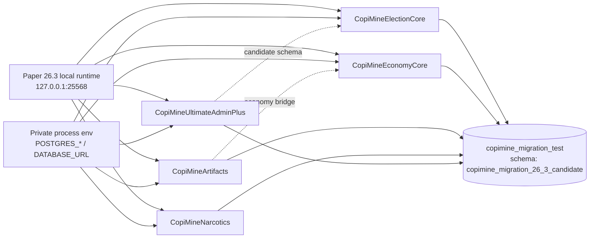
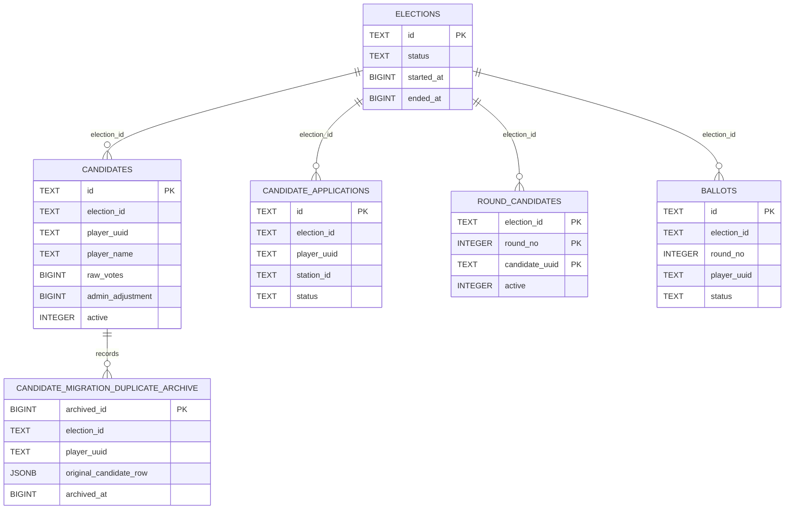

# Базы данных миграционного runtime

Этот документ описывает только изолированную базу кандидата Minecraft 26.3 и контрактные тестовые схемы. Production/Supabase базы этим этапом не читаются и не изменяются. Пароли находятся в локальных private env файлах, не в Git и не в этом документе.

## Runtime database boundary

`StartMigrationTestServer.ps1` настраивает один локальный PostgreSQL:

| Поле | Значение кандидата |
| --- | --- |
| Host | `127.0.0.1` |
| Port | `55434` |
| Database | `copimine_migration_test` |
| Schema | `copimine_migration_26_3_candidate` |
| Role | `copimine_migration_test` |

Подключение передаётся плагинам через защищённый env-файл. `MigrationDatabaseEnvironment.psm1` запрещает повторные ключи, пустой пароль, ссылки на credential-файлы и небезопасные пути; логика не использует shared database как fallback.

Верхнеуровневая принадлежность таблиц по коду:

- ElectionCore создаёт `elections`, `election_stages`, `polling_stations`, `candidate_applications`, `candidates`, `round_candidates`, `ballots` и связанные голосовательные таблицы.
- EconomyCore создаёт счета, ledger/transfer intents, донатные покупки и recovery-таблицы; Artifacts проводит оплату и возвраты через EconomyCore bridge.
- Artifacts хранит собственные shop/purchase state и безопасно повторяет reconciliation неподтверждённых переводов.
- NarcoticsDatabase хранит версии схемы, brewing state, overdose/usage окна, configuration values и admin audit.
- AdminPlus использует каноническую схему кандидатов ElectionCore и не создаёт отдельную таблицу-копию `candidates`.

Имена и DDL авторитетны в migration code; схемы не имеют объявленных PostgreSQL foreign key там, где связи реализованы через bridge или идентификаторы приложения. Не выводите FK по одному совпадающему столбцу.

## Схема ElectionCore и legacy candidate repair

Канонический кандидат однозначно идентифицируется парой `(election_id, player_uuid)`. Legacy `uuid` и `name` читаются для миграции, но новые операции используют `player_uuid` и `player_name`.

Перед созданием уникального индекса `(election_id, player_uuid)` ElectionCore суммирует `raw_votes` и `admin_adjustment`, сохраняет каждую удаляемую legacy-строку в `candidate_migration_duplicate_archive.original_candidate_row`, оставляет одну строку игрока и только потом создаёт уникальность. Совместимые `uuid`/`name` колонки освобождаются от старых `PRIMARY KEY`, `UNIQUE` и `NOT NULL`, чтобы новые канонические вставки не блокировались устаревшими ограничениями.

Связи в Mermaid ER-диаграмме показывают логические связи по идентификаторам приложения. Это не утверждение о декларативных PostgreSQL foreign key: фактический DDL для этих таблиц их не объявляет.

## Изолированные contract-test схемы

`tests/test_minecraft_26_3_custom_plugin_database_contracts.py` проверяет подключение к `copimine_migration_test`. Перед каждым PostgreSQL contract test создаётся отдельная schema с случайным суффиксом; после теста удаляется только эта schema:

- `candidate_duplicate_<uuid>` проверяет объединение tally и архивирование дублей.
- `candidate_legacy_constraints_<uuid>` проверяет перенос старых `uuid`/`name`, включая expression unique index, и успешный канонический insert после снятия legacy constraint.

Локальный тест требует loopback PostgreSQL; CI может разрешить только private адрес временного runner service. Публичный адрес запрещён. Тест без `COPIMINE_TEST_POSTGRES_DSN` считается skipped, а не passed.
